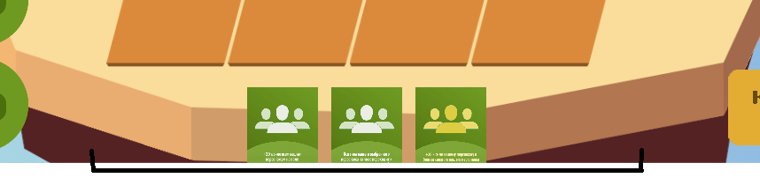
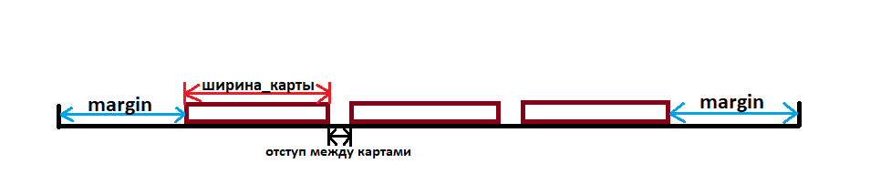
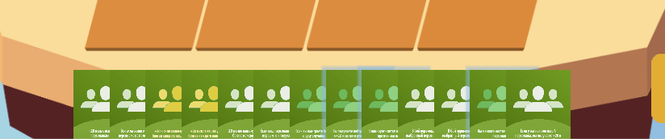
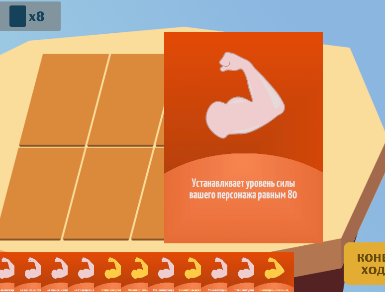
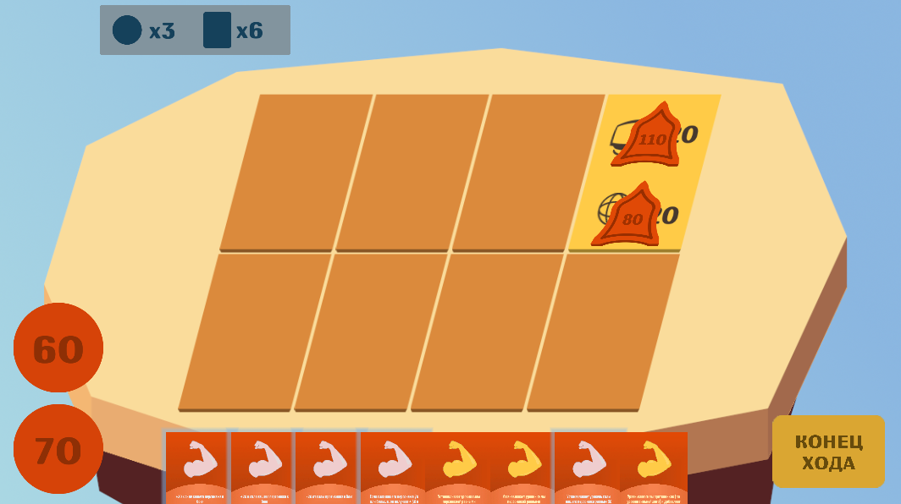

# Панель карт

*Документ составил Златокрылец Николай*

### Задача
Необходимо реализовать панель с картами игрока, которые на данный момент находятся у него в руке. В каждый момент времени карты должны находиться на равном расстоянии друг от друга. Если карт в руке много, они не должны вылезать за правый и левый края панели. Если карт в руке мало, они должны не занимать всё пространство панели, а группироваться в центре.

При наведении мыши на карту панели должна отображаться её увеличенная версия для того, чтоб можно было прочитать описание.

В ход игрока доступные для разыгрывания карты должны подсвечиваться голубым цветом на панели карт

### Решение

#### Общий подход
Панель с картами реализована как UI-элемент типа Panel. Карты панели представляют из себя дочерние по отношению к панели объекты Image.

Каждый раз, когда меняется количество карт в панели, вызывается метод, который исправляет координаты объектов-карт. 

#### Вычисление координат карт
Есть две ситуации, которые необходимо обрабатывать по-разному:

1. Количество карт в руке слишком мало: их суммарная ширина + суммарная ширина отступов между картами меньше ширины панели.

Пример такой ситуации изображен на рисунке ниже.

В такой ситуации необходимо рассчитать расстояние от краев панели до крайних карт. Вычисляется оно по следующей формуле:

margin = (ширина_панели - суммарная_ширина_карт_и_отступов_между_ними) / 2

После этого Х-координата каждой карты (0 по иксу - левый край панели) вычисляется следующим образом (Х-координата карты - координата её левого края):

coordX = margin + индекс_карты * (ширина_карты + отступ_между_картами)

Таким образом, все карты на панели располагаются в центре, на равном фиксированном расстоянии друг от друга. Графическая иллюстрация формулы приведена на рисунке ниже.

2. Количество карт в руке таково, что их суммарная ширина + суммарная ширина отступов между картами превышает ширину панели

Пример такой ситуации изображен на рисунке ниже.

Решение проблемы в таком случае следующее. Вычисляем расстояние между центрами карт (в общем случае они могут накладываться друг на друга) по следующей формуле:

cardsDist = (ширина_панели - ширина_карты) / (количество_карт - 1)

*Пояснение к формуле.* Мы вычисляем расстояние между левыми краями карт. Для этого нам нужно из всего пространства панели по горизонтали вычесть ширину одной карты (той, которая находится справа и показывается полностью) и разделить эту длину на количество промежутков между картами (их на 1 меньше, чем карт).

Далее Х-координата карты в панели вычисляется по формуле ниже:

coordX = cardsDist * индекс_карты

Таким образом, карты занимают всё пространство панели и находятся на равном расстоянии друг от друга.

#### Отображение увеличенной версии карты при наведении мыши

Пример такой увеличенной версии изображен на рисунке ниже.

##### Путь решения
Данная возможность была реализована следующим образом. Каждая карта представляет из себя объект-наследник MonoBehaviour (имеющий компонент UI Image), который хранит в себе дочерний объект такого же типа. При инициализации объекта-карты, инициализируется также дочерний объект с увеличенными в 4 раза размерами, который после инициализации становится неактивен. При наведении мыши на карту, её увеличенная версия становится активной. Когда курсор покидает область карты, увеличенная версия становится неактивной.

##### Преимущества
Увеличенные версии начальных карт создаются сразу при загрузке игры. Создание объектов не занимает время непосредственно в момент наведения на карту.

##### Недостатки
Увеличено время загрузки игры, особенно если игрок имеет большое количество карт в стартовой руке.

##### Проблемы, возникшие в ходе решения
Поскольку увеличенная версия карты является таким же объектом, как и обычная версия, она обладает всеми свойствами обычной карты на панели, в том числе, созданием своей увеличенной версии. В связи с этим возникал баг, из-за которого можно было навести курсор мыши на увеличенную версию карты и увидеть сверху от неё еще в 4 раза увеличенную версию этой же карты. Баг был исправлен удалением компонента Script из увеличенной версии карты после её инициализации. Увеличенная версия карты является просто изображением, которое никак не взаимодействует с игроком, потому её компонент Script можно удалить.

##### Альтернативные пути решения
Первоначально увеличенная версия карты не создавалась сразу после её добавления на панель (инициализации), а с момент наведения мыши. И уничтожалась, когда курсор покидал область карты. Онако, это вызывало проблемы с производительностью, а также приводило к непредсказуемому поведению, когда курсор мыши перемещался слишком быстро по панели. В связи с этим была проведена оптимизация, в ходе которой была написана реализация, описанная выше.

#### Подсветка доступных карт на панели

В ход игрока карты, которые можно разыграть в данный момент, подсвечиваются голубым цветом.

##### Путь решения
Для подсветки был создан префаб, представляющий из себя элемент UI Image. В объекте панели карт хранится хеш-таблица со всеми объектами подсветки, которые созданы и отбражаются в данный момент. Когда вызывается метод подсветки карт, на основании списка карт, которые можно разыграть в данный момент (список передается в метод и формируется контроллером игры на основании правил), создаются объекты подсветки и им присваивается позиция соответствующих им карт. В случае изменения позиции карты, изменяется также позиция её подсветки. Когда вызывается метод удаления подсветок карт, все объекты подсветки удаляются.

##### Альтернативные пути решения
* *Не создавать объекты подсветки каждый раз, когда необходимо подсветить карты, а один раз, при добавлении карты в панель.* Данный вариант реализации не был принят, поскольку потеря производительности при текущем варианте подсветки невелика и является несущественной: подсветка создается в начале хода игрока и удаляется после совершения действия. В эти моменты даже небольшая потеря кадров является несущественной. В то же время, реализация такого варианта подсветки является более громоздкой и менее производительной при изменении количества карт в панели: необходимо хранить помимо карт также их подсветки, при смене позиции карты менять также позицию подсветки, даже если она неактивна в данный момент.
* *Хранить объекты подсветки на в панели карт, а в объектах самих карт.* Данный вариант реализации является вполне приемлимым вариантом решения. Однако он не дает ощутимых преимуществ как в производительности, так и в читаемости кода, по сравнению с текущим вариантом реализации.
